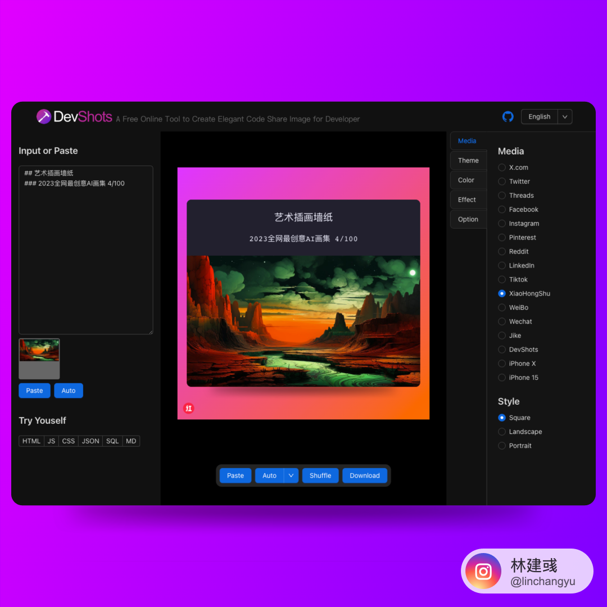
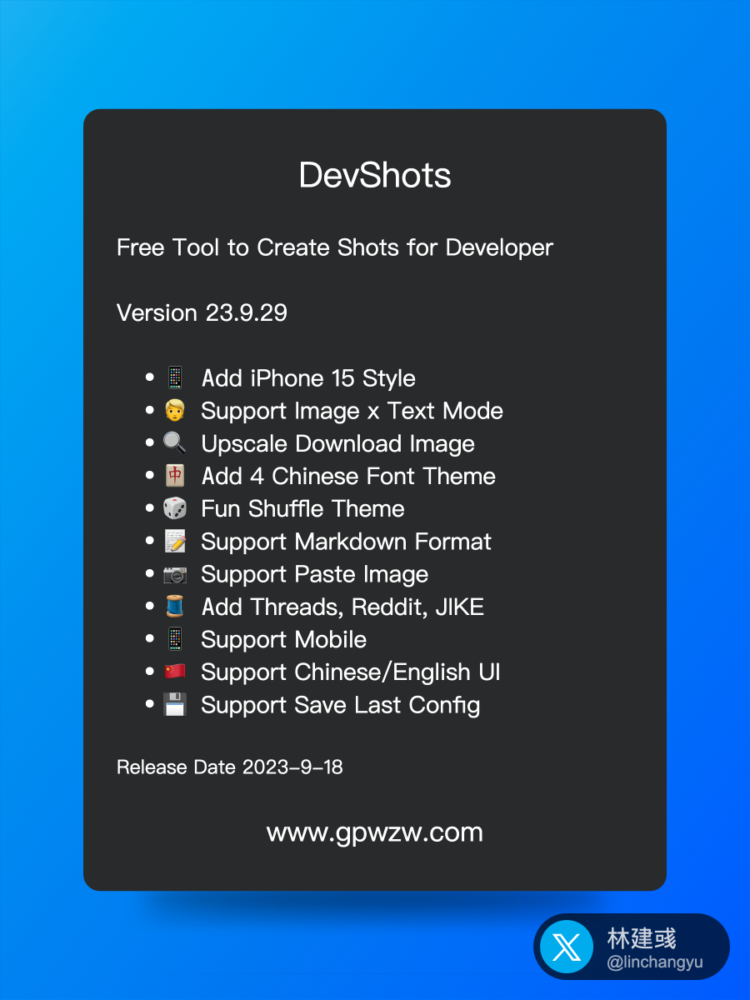
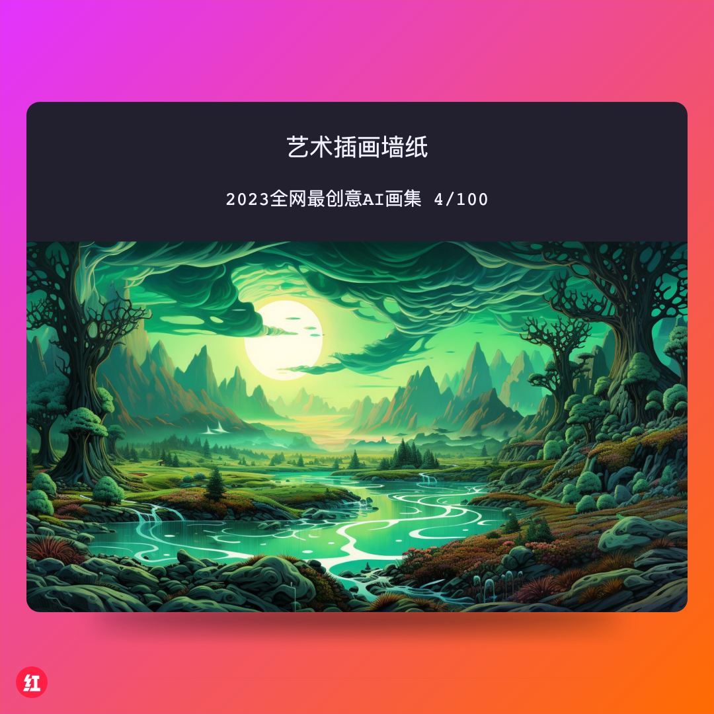

# DevShots
Developer Tool to Create Code Share Image

## Products

You can use this tool at [gpwzw.com](https://www.gpwzw.com).

App is planing.

## Feature

You can use DevShots to make Code Image, ScreenCapture Image, even iPhone Mockup

Now we have these features:

 * X.com(Twitter), Threads, Facebook, Instagram, Pinterest, Reddit, LinkedIn, TikTok Media templates. with Square, Landscape, Portrait Style.
 * Lots of code themes, Chinese themes, iPhone themes.
 * Lots of good design background.
 * Text and Image Mode Choices.
 * 5 Font Size and 5 Padding Size to adjust content faster.
 * Support Mac, Windows, iPhone Mockup effect.
 * Support media watermark, with your username and userid.

## Some Works

## User Feedback

waiting for your advice.

## Roadmap

We want to help Developers to make all kinds share images quickly.

 * AppStore images
 * More Chinese Fonts
 * More Code themes
 * Post image to Social Media Shortcuts

## One more thing

Welcome add issues and discuss with us.Try it now on  [gpwzw.com](https://www.gpwzw.com).
